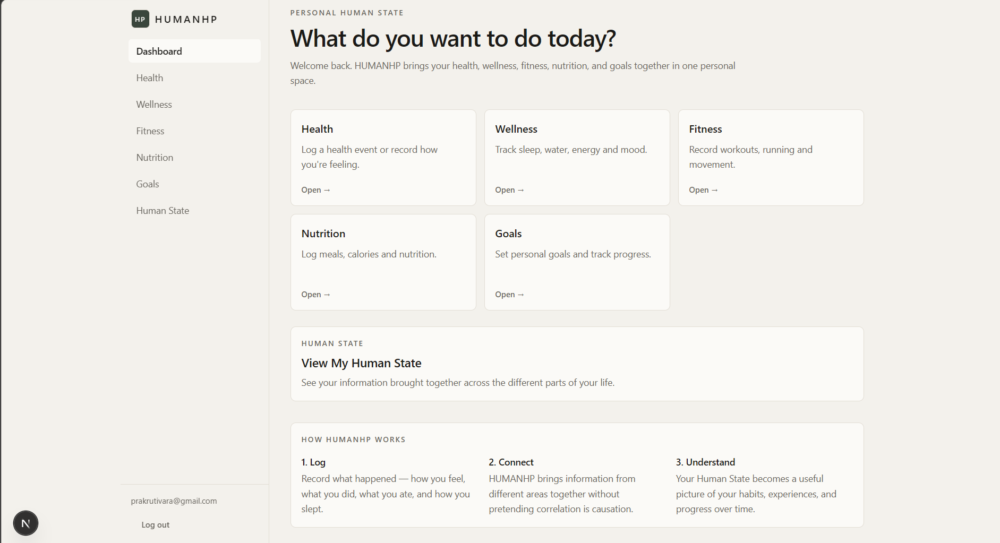
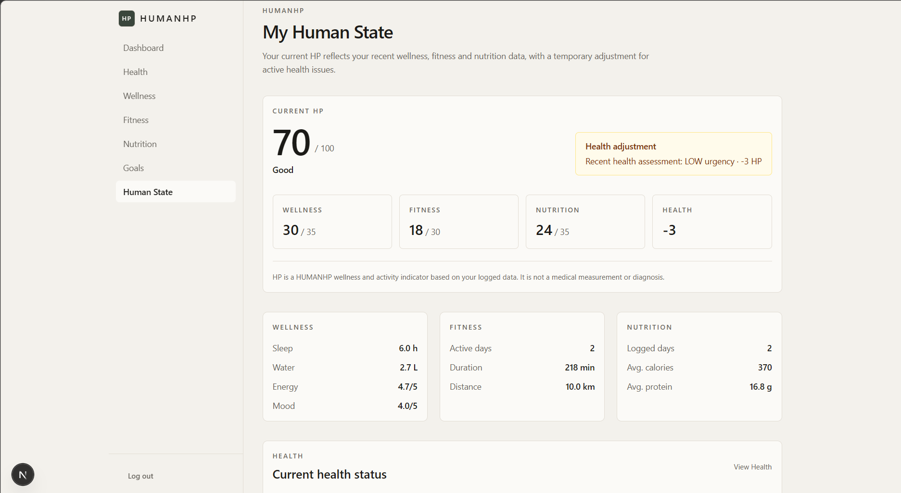

# HUMANHP

<p align="center">
  <strong>A personal Human State platform.</strong><br>
  Health, wellness, fitness, nutrition, and goals — brought together in one place.
</p>

<p align="center">
  
  
  
  
</p>

---

## Overview

**HUMANHP** is a web-first personal Human State system built around a simple idea:

> Personal health and wellbeing make more sense when their different signals are viewed together.

Instead of building separate trackers with no connection between them, HUMANHP lets a user record five areas of their life:

| Domain | What is tracked |
| --- | --- |
| **Health** | Symptoms, health events, severity, duration |
| **Wellness** | Sleep, water, energy, mood |
| **Fitness** | Activities, duration, distance, intensity |
| **Nutrition** | Meals, calories, protein, supplements |
| **Goals** | Personal goals and measurable progress |

These records form the foundation of a structured **Human State** that can be analyzed for meaningful, evidence-supported observations.

---

## Product

The interface is intentionally focused: users can move directly into the part of their Human State they want to work with, or view the combined state.

### Dashboard



### Human State



HUMANHP also supports conversational, AI-assisted Health Assessment.

A user can describe symptoms naturally. When more information is needed, the assistant asks focused follow-up questions. Once enough information is available, it can organize the information into:

- Symptoms and severity
- Duration
- Possible explanations
- Warning signs
- Recommended next steps
- Doctor-urgency guidance

**This is not a diagnostic system.** Possible explanations are informational, not definitive medical conclusions. Users should seek appropriate professional medical care when symptoms are severe, worsening, or accompanied by warning signs.

---

## The Engineering Idea

The central design decision in HUMANHP is to separate **deterministic computation** from **AI interpretation**.

```text
User Data
    │
    ▼
Human State
    │
    ├── Deterministic metrics
    ├── Aggregations
    └── Evidence-supported observations
    │
    ▼
AI Context
    │
    ▼
AI Provider
    │
    ▼
Natural-language interpretation
```

If the application can calculate something reliably, it does so in application code.

For example, when distance and duration are available, running/walking pace is calculated deterministically rather than delegated to a language model.

AI is reserved for tasks where language understanding adds value — such as conversational health assessment and contextual interpretation.

This keeps important calculations reproducible and makes the AI layer easier to replace or extend.

---

## Human State

The **Human State** is the core of the product.

It brings together recent information from the five domains and turns raw records into a structured view containing:

- Wellness summaries
- Recent health information
- Fitness activity
- Nutrition summaries
- Goals and measurable progress
- Cross-domain observations

### Evidence over assumptions

HUMANHP is designed to report what the available data supports rather than inventing a story around it.

For example:

> **Lower sleep was observed on days with higher activity.**

rather than:

> **Your workout caused your poor sleep.**

The system favors language such as *observed alongside*, *coincided with*, and *may be worth watching* when describing patterns.

---

## Architecture

```text
┌──────────────────────────────────────────────┐
│                 Next.js App                  │
│                                              │
│ Health │ Wellness │ Fitness │ Nutrition │ Goals
│                      │                       │
│                      ▼                       │
│               Human State View               │
└──────────────────────┬───────────────────────┘
                       │
                       ▼
              ┌─────────────────┐
              │    Supabase     │
              │ Auth + Database │
              └────────┬────────┘
                       │
                       ▼
              ┌─────────────────┐
              │    Analytics    │
              │  Deterministic  │
              └────────┬────────┘
                       │
                       ▼
              ┌─────────────────┐
              │    AI Context   │
              └────────┬────────┘
                       │
                       ▼
              ┌─────────────────┐
              │   AI Gateway    │
              │  OpenAI-style   │
              │     API         │
              └─────────────────┘
```

### Technology

- **Next.js / React** — web application
- **TypeScript** — application logic and types
- **Tailwind CSS** — UI styling
- **Supabase** — authentication and persistent data
- **OpenAI SDK** — OpenAI-compatible client interface
- **FreeLLMAPI** — current local AI gateway for development
- **Zod** — validation where applicable

---

## AI Provider Strategy

The application is **provider-independent by design**.

The current development setup uses FreeLLMAPI because it provides a local OpenAI-compatible endpoint and allows the project to work without directly embedding a paid model-provider dependency into the application.

FreeLLMAPI is therefore a **development/runtime gateway, not the Human State architecture itself**.

Conceptually:

```text
                HumanHP
                   │
              AI Context
                   │
                   ▼
            OpenAI-compatible
               interface
                   │
          ┌────────┴────────┐
          ▼                 ▼
     FreeLLMAPI        Future provider
      (current)          (replaceable)
```

The goal is to keep the Human State engine independent from whichever model or gateway is used underneath it.

---

## Data & Security

HUMANHP is built around authenticated, user-owned records.

- Users authenticate through Supabase.
- Records are associated with authenticated user IDs.
- Database access is protected with Row Level Security where configured.
- Server-side credentials are kept out of client code.
- Environment files containing secrets are excluded from Git.

The repository intentionally contains `.env.example`, but **never `.env.local`**.

---

## Getting Started

### Prerequisites

- Node.js
- npm
- A configured Supabase project
- FreeLLMAPI running locally for the current AI setup

### 1. Clone

```bash
git clone https://github.com/prakrutivara/HumanHP.git
cd HumanHP
```

### 2. Install dependencies

```bash
npm install
```

### 3. Configure environment variables

Create `.env.local` using `.env.example` as a template.

The current AI configuration uses:

```env
FREELLMAPI_BASE_URL=http://127.0.0.1:31415/v1
FREELLMAPI_API_KEY=your_local_unified_key
```

Add your own Supabase project values as well.

**Never commit `.env.local` or any API key.**

### 4. Start the development server

```bash
npm run dev
```

Then open:

```text
http://localhost:3000
```

### About the current AI setup

The current development version expects FreeLLMAPI to be running on the same machine. A cloned copy of the repository therefore does **not** automatically have access to the original developer's local AI gateway or credentials.

---

## Project Structure

```text
app/
├── api/
│   ├── health-assistant/
│   ├── insight/
│   └── test/
├── auth/
└── dashboard/
    ├── health/
    ├── wellness/
    ├── fitness/
    ├── nutrition/
    ├── goals/
    └── state/

components/
├── auth/
├── brand/
├── layout/
└── ui/

lib/
├── ai/
├── supabase/
├── analytics.ts
├── types.ts
└── seedData.ts

scripts/
```

---

## Design Principles

### Data first
Insights should be grounded in actual user records.

### Deterministic where possible
Metrics and arithmetic belong in application code when they can be calculated reliably.

### AI for language
AI adds value through natural-language interaction and interpretation, not by replacing deterministic business logic.

### Observation over causation
Correlations and co-occurring patterns are described cautiously rather than presented as proven causes.

### User-owned data
Authenticated users should only access their own records.

### Provider independence
The Human State engine should not depend on one particular model provider or gateway.

### Product simplicity
The interface prioritizes clarity, compact information, responsive layouts, and consistent interactions over decorative complexity.

---

## Roadmap

The project is actively evolving. Near-term areas include:

- [ ] Expand cross-domain Human State insights
- [ ] Improve AI context and conversational continuity
- [ ] Strengthen automated testing and validation
- [ ] Prepare a deployment architecture for a public demo
- [ ] Add more polished product documentation and walkthroughs

---

## Project Status

**Active development**

HUMANHP is being developed as a practical exploration of how personal health and everyday wellbeing can be represented as one connected system — combining persistent user data, deterministic analytics, and carefully scoped AI interaction.

---

## Health Disclaimer

HUMANHP's Health Assessment is an **AI-assisted informational feature and is not a medical diagnosis**.

Possible explanations are not definitive. The application should not be used as a substitute for professional medical advice, diagnosis, or treatment.

---

<p align="center">
  <strong>HUMANHP</strong><br>
  <sub>One place to understand the different parts of your Human State.</sub>
</p>
